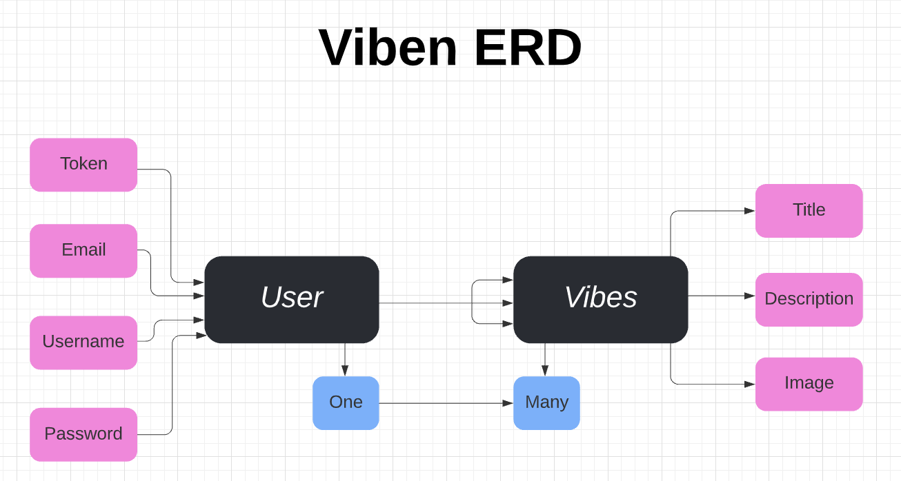

# Application Title: Viben

Connect. Share. Vibe. I created this app because I love to adventure and love to share photos with my friends. This application allows the user to create an account and sign in to post images ('vibes'), add them to a 'favorites' section, and share them on a global feed, where other users can view and like each other's vibes. Now go on and get Viben!

### App Use Instructions

To view the live application, follow the 'deployed client' link below, and Sign Up to create an account or Sign In with the following credentials:

Email: test@test.com
Password: test

### Setup Steps on Local Device

1. Fork and clone this repository.
2. Install dependencies with `npm install`.
3. Install nodemon with `npm i nodemon`.
4. Start backend application on your local host with `nodemon`.

## Important Links

- [Deployed Client](https://gargygargz.github.io/viben-client)
- [Deployed API](https://quiet-brushlands-25069.herokuapp.com)
- [Frontend Repository](https://github.com/gargygargz/viben-client)

### Technologies Used

- JavaScript
- jQuery
- HTML/CSS
- Bootstrap
- MongoDB
- Mongoose
- Express
- React

### Planning Strategy

After deciding on an app idea and title, I developed a planning board to track my progress. I wanted Viben to have a simple layout with a navigation bar and a main area for viewing content. After developing my user stories and drawing up my wireframes and ERD, I started with the backend API and created and tested the user auth (sign-up, sign-in, change password, sign-out) and vibe (create, show all, show one, update, delete) routes. I then worked on the front end and created and tested corresponding React components for the user auth and vibe CRUD actions. I then created and tested the like and favorite buttons, and last but not least, styled the app to make it as 'vibey' as possible, while maintaining a user-friendly, simple design.

### Unsolved Problems / Future Updates

- Add the ability for a user to upload an image file to a vibe.
- Add the ability for a user to comment on a vibe.

### API Routes

| Endpoint           | Component        | `AuthenticatedRoute`? |
| ------------------ | ---------------- | --------------------- |
| `/`                | `Home`           | No                    |
| `/sign-up`         | `SignUp`         | No                    |
| `/sign-in`         | `SignIn`         | No                    |
| `/change-password` | `ChangePassword` | Yes                   |
| `/sign-out`        | `SignOut`        | Yes                   |
| `/vibes/all`       | `VibesAllUsers`  | Yes                   |
| `/vibes`           | `VibesOneUser`   | Yes                   |
| `/vibes/create`    | `VibeCreate`     | Yes                   |
| `/vibes/:id`       | `Vibe`           | Yes                   |
| `/vibes/:id/edit`  | `VibeEdit`       | Yes                   |
| `/vibes/favorites` | `VibeFavorites`  | Yes                   |

### Entity Relationship Diagram

